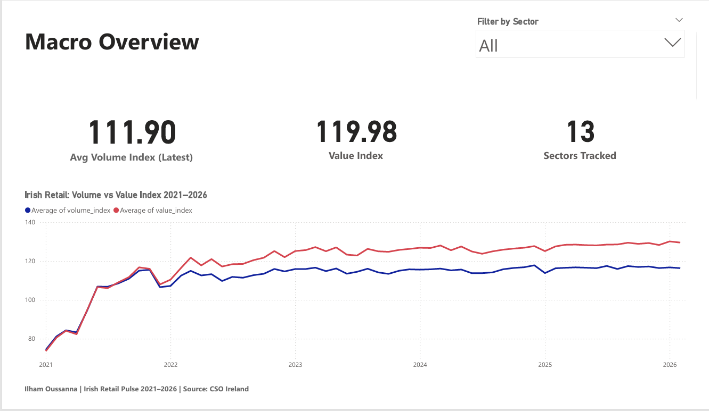
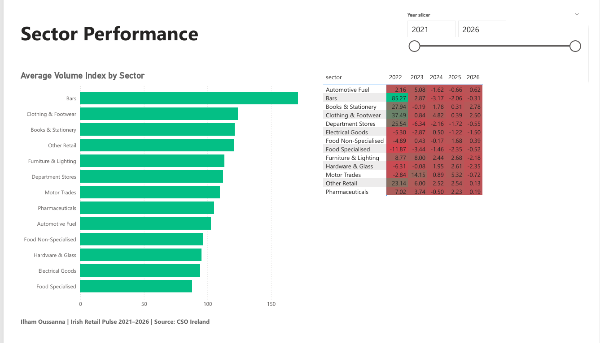
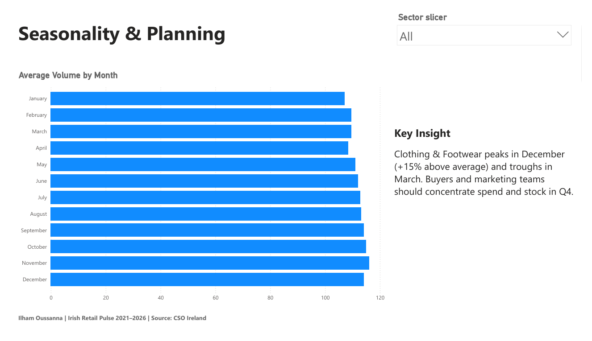
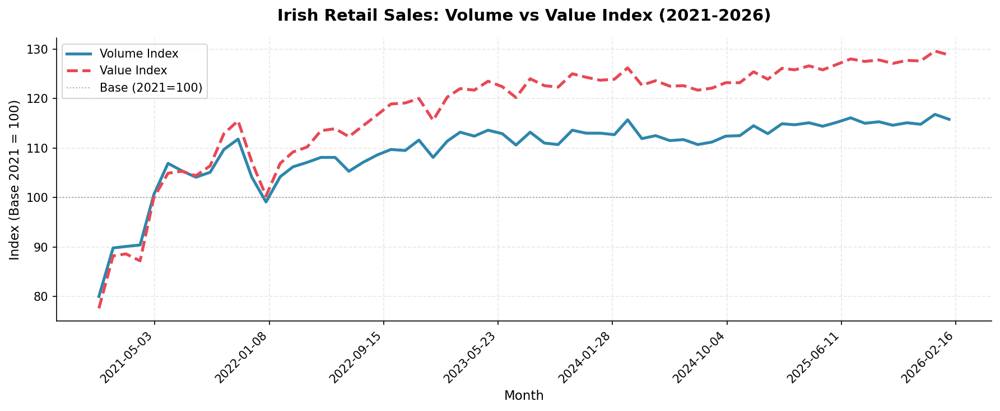
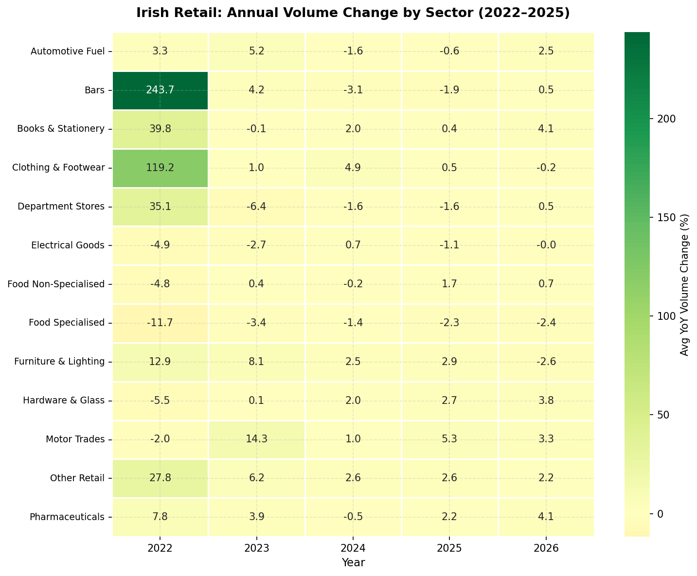
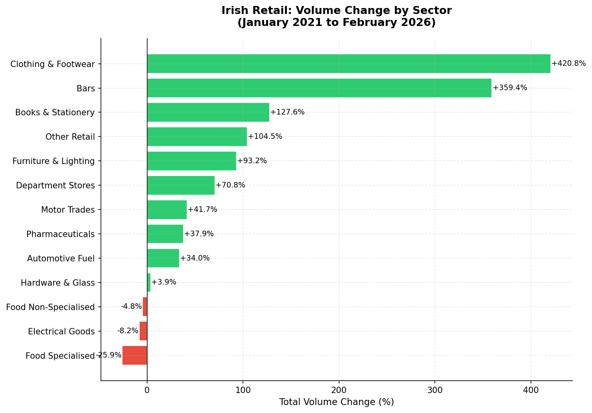
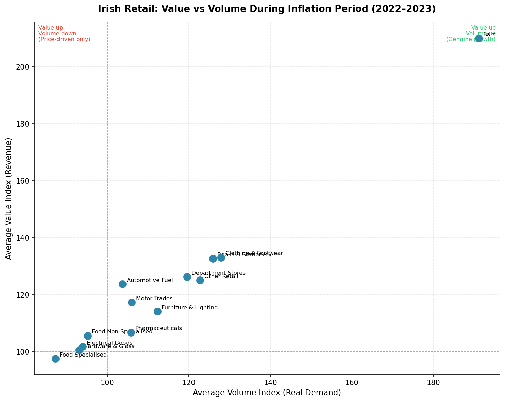
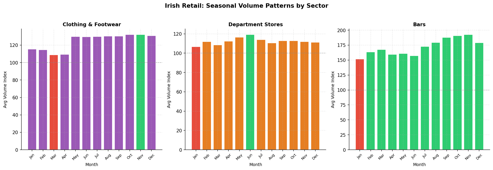

# Irish Retail Pulse — Sector Performance & Consumer Trends 2021–2026

End-to-end retail analytics project using **official Irish government data** from the Central Statistics Office (CSO). The analysis covers 62 months of retail sales across 13 sectors, identifies structural winners and losers, quantifies the inflation gap between revenue and real consumer demand, and uncovers seasonal patterns for operational planning.

---

*Dataset source: [CSO Ireland — Retail Sales Index (RSM08)](https://statbank.cso.ie)*

---

## 📋 Project Overview

| | |
|---|---|
| **Dataset** | CSO Ireland — Retail Sales Index (RSM08) |
| **Tools** | PostgreSQL · Python · Power BI |
| **Analysis Type** | Retail Sector Performance & Consumer Trend Analysis |
| **Sectors Analysed** | 13 individual retail sectors |
| **Period Covered** | January 2021 — February 2026 (62 months) |
| **Records Processed** | 10,912 raw → 868 clean rows |

---

## 🎯 Business Objective

Three key questions this analysis answers:
- **Which Irish retail sectors are genuinely growing** in real consumer demand — and which are under structural pressure?
- **How much of Irish retail revenue growth is price-driven** versus actual increases in purchasing activity?
- **What seasonal patterns** exist across sectors, and how should businesses plan around them?

---

## 🔑 Key Findings

| Finding | Detail |
|---|---|
| **Inflation gap** | Value index reached ~129 by 2026 vs volume index of ~116 — a 13-point gap showing most revenue growth is price-driven, not demand-driven |
| **Structural decline** | Food Specialised stores declined in volume every single year 2022–2026 — the only sector with no recovery |
| **COVID base effect** | Clothing & Footwear (+420%) and Bars (+359%) reflect reopening from near-zero, not organic growth |
| **Hidden winners** | Furniture & Lighting, Books & Stationery, and Motor Trades show genuine sustained volume growth |
| **Seasonal concentration** | Clothing peaks in December (+15% above average); Bars craters in January — predictable and plannable |

---

## 💡 Strategic Recommendations

| Priority | Finding | Recommendation |
|---|---|---|
| 📊 TRACK | Revenue ≠ real demand | Add volume tracking alongside revenue in all internal reporting |
| ⚠️ REVIEW | Food Specialised, Electrical Goods declining every year | Review channel strategy and physical footprint exposure |
| 📅 PLAN | Clear seasonal peaks and troughs by sector | Build data-backed seasonal planning calendars — not gut feel |

---

## 📸 Dashboard

### Page 1 — Macro Overview


### Page 2 — Sector Performance


### Page 3 — Seasonality & Planning


---

## 📊 Analysis Charts

### Overall Retail Trend — Volume vs Value 2021–2026


### Year-on-Year Volume Change Heatmap by Sector


### Winners and Losers — Total Volume Change


### Value vs Volume During Inflation Period 2022–2023


### Seasonal Volume Patterns by Sector


---

## 🛠️ Tools & Methodology

### PostgreSQL
- Created `irish_retail` database with `rsi_raw` table mirroring the raw CSO CSV
- Verified data load: 10,912 rows, 8 statistic types, 22 NACE groupings, 62 months
- Ran validation queries: row counts, distinct sector names, date range checks

### Python (Jupyter Notebook)
- **01_cleaning.ipynb** — Full data cleaning pipeline:
  - Filtered 8 statistic types down to 2 (seasonally adjusted Value and Volume indices)
  - Removed overlapping NACE sector aggregates — kept 13 individual sectors + All Retail
  - Converted `"2021 January"` text format to proper datetime
  - Mapped long NACE names to clean short labels
  - Separated Value and Volume into columns, merged into single row per sector per month
  - Final output: 868 rows, 4 columns, zero nulls
- **02_analysis.ipynb** — Five analytical charts with business narrative:
  - Overall trend line (volume vs value divergence)
  - Sector heatmap (YoY % change by year)
  - Winners vs losers bar chart (full period volume change)
  - Inflation scatter plot (value vs volume 2022–2023)
  - Seasonal decomposition for Clothing, Department Stores, and Bars

### Power BI
- Built 3-page interactive dashboard using `rsi_clean.csv`
- Page 1: KPI cards (Volume Index, Value Index, Sectors Tracked) + trend line chart + sector slicer
- Page 2: Ranked bar chart + YoY volume change matrix with conditional formatting (red/green) + year slicer
- Page 3: Monthly volume bar chart sorted by month number + sector dropdown slicer + Key Insight text box
- Custom DAX measure for YoY Volume Change % to match Python heatmap analytically
- Attribution footer on all pages: Ilham Oussanna | Irish Retail Pulse 2021–2026 | Source: CSO Ireland

---

## 📁 Project Structure

```
irish-retail-pulse/
│
├── data/
│   ├── rsi_monthly_raw.csv        # Raw CSO download
│   └── rsi_clean.csv              # Cleaned dataset (868 rows)
│
├── notebooks/
│   ├── 01_cleaning.ipynb          # Data cleaning pipeline
│   └── 02_analysis.ipynb          # Exploratory analysis and charts
│
├── charts/
│   ├── chart1_overall_trend.png
│   ├── chart2_sector_heatmap.png
│   ├── chart3_winners_losers.png
│   ├── chart4_inflation_scatter.png
│   └── chart5_seasonality.png
│
├── screenshots/
│   ├── page1_macro_overview.png
│   ├── page2_sector_performance.png
│   └── page3_seasonality.png
│
├── report/
│   ├── Irish_Retail_Pulse_Report.docx   # Full written report (non-technical)
│   └── Irish_Retail_Pulse_Dashboard.pdf # Power BI dashboard export
│
└── README.md
```

---

## 📌 Data Source Notes

- **Source:** Central Statistics Office Ireland — Retail Sales Index (RSM08)
- **Licence:** CSO Open Data — free to reuse with attribution
- **Index base year:** 2021 = 100
- **Series used:** Seasonally adjusted Value Index and Volume Index only
- **Scope:** Retail businesses registered in Ireland — excludes online-only retailers not registered in Ireland
- **Update frequency:** Published monthly by the CSO

---

## 👤 Author

**Ilham Oussanna** — Data Analyst  
🔗 [LinkedIn](https://www.linkedin.com/in/ilham-o-89372a274)
